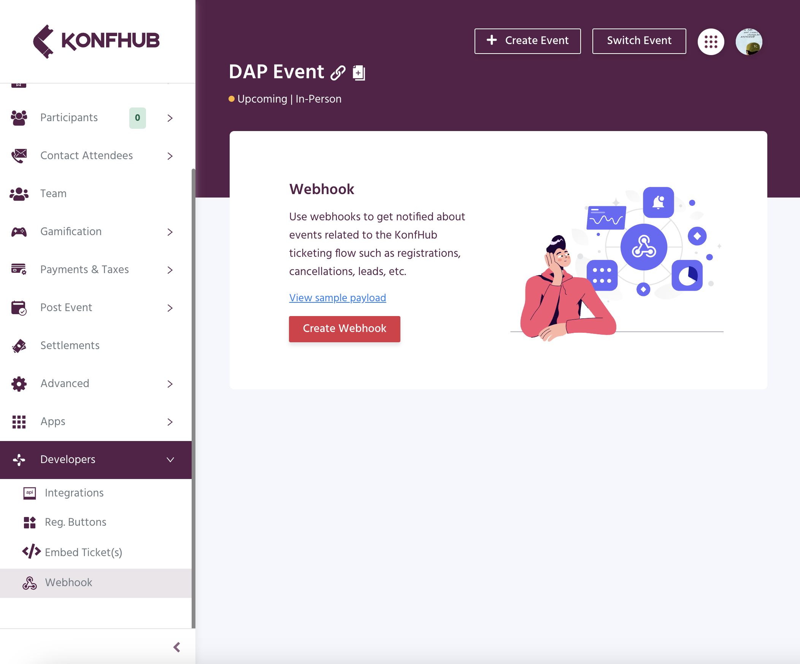
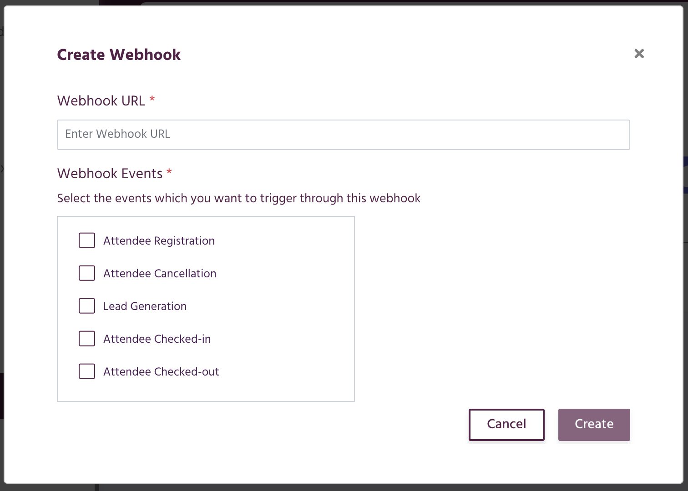
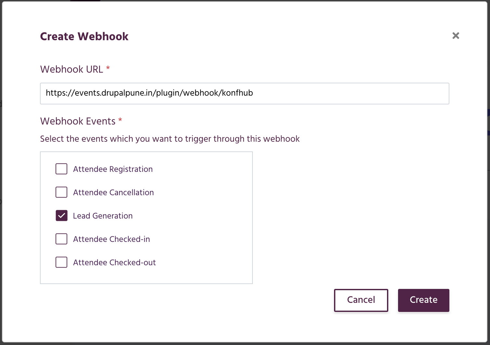
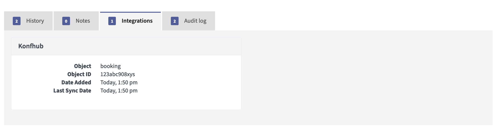

# plugin-konfhub

INTRODUCTION
------------

Integrate KonfHub with Mautic to nurture the leads and enable personalized communication.

INSTALLATION
------------

1. Get the plugin using `composer require drupalpune/plugin-konfhub`
2. Install it using `php bin\console mautic:plugins:reload`.
3. The plugin will start listing on plugin page. 

CONFIGURATION
-------------

1. Login to the event dashboard Konfhub.
2. Navigate to Developers > Webhook 
3. Click on **Create webhook** button, this will pop open a window 
4. Fill in the following details
   1. Webhook URL: `<your-domain>/plugin/webhook/konfhub` 
   2. Webhook Events: Select **Lead Generation**
       
5. And click on create.
6. Now whenever there is `lead` type event, the mautic will receive the payload and will create/update the lead.
7. Please check the integration tab on Contact's details page for booking details. 

AUTHOR
------

👤 **Rahul Shinde**

- Github: [@shinde-rahul](https://github.com/shinde-rahul)
- Twitter: [@_rahulshinde](https://twitter.com/_rahulshinde)
