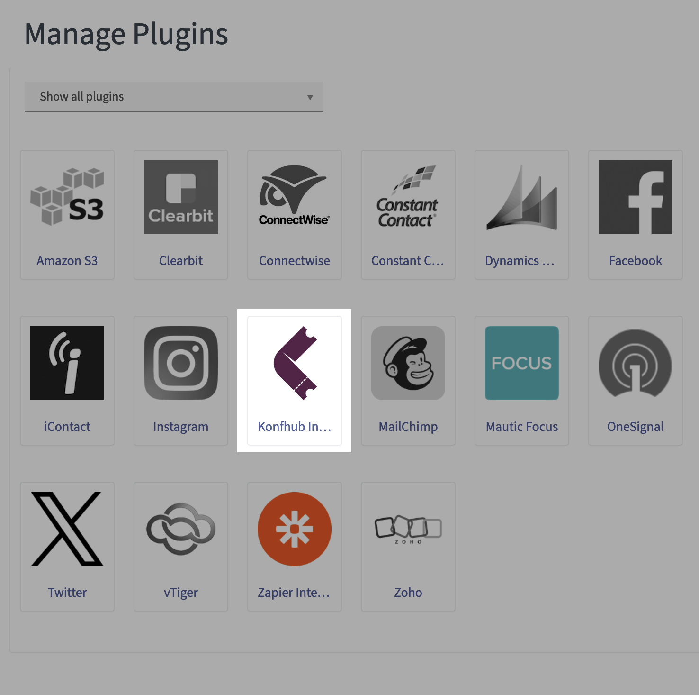

# plugin-konfhub

INTRODUCTION
------------

Integrate KonfHub with Mautic to nurture the leads and enable personalized communication.

INSTALLATION
------------

1. Get the plugin using `composer require drupalpune/plugin-konfhub`
2. Install it using `php bin\console mautic:plugins:reload`.
3. The plugin will start listing on plugin page. 

CONFIGURATION
-------------

AUTHOR
------

👤 **Rahul Shinde**

- Twitter: [@_rahulshinde](https://twitter.com/_rahulshinde)
- Github: [@shinde-rahul](https://github.com/shinde-rahul)
